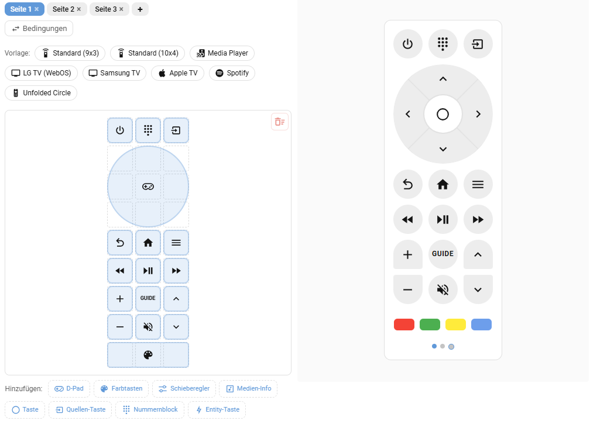

# Grid Remote Card

A fully customizable TV/media remote control card with drag-and-drop grid layout, multiple button types, source popup, and a visual editor.

[](https://github.com/hacs/integration)
[](https://github.com/thecodingdad/grid-remote-card/releases)

## Screenshot



## Features

- 7 item types: D-Pad, Color Buttons, Slider, Media Info, Button, Source Button, Number Pad, Entity Button
- Configurable grid layout with drag-and-drop in visual editor
- Multiple button variants: round, pill (4 directions), square, rounded
- Entity toggle with background color feedback
- Slider auto-configuration per domain (light, media_player, cover, fan, number)
- Source popup menu for media player source selection
- Full visual editor with item drag-and-drop
- Hold/double-tap/swipe action support with repeat intervals
- EN/DE multilanguage support

## Prerequisites

- Home Assistant 2026.3.0 or newer
- HACS (recommended for installation)

## Installation

### HACS (Recommended)

[](https://my.home-assistant.io/redirect/hacs_repository/?owner=thecodingdad&repository=grid-remote-card&category=plugin)

Or add manually:
1. Open HACS in your Home Assistant instance
2. Click the three dots in the top right corner and select **Custom repositories**
3. Enter `https://github.com/thecodingdad/grid-remote-card` and select **Dashboard** as the category
4. Click **Add**, then search for "Grid Remote Card" and download it
5. Reload your browser / clear cache

### Manual Installation

1. Download the latest release from [GitHub Releases](https://github.com/thecodingdad/grid-remote-card/releases)
2. Copy the `dist/` contents to `config/www/community/grid-remote-card/`
3. Add the resource in **Settings** → **Dashboards** → **Resources**:
   - URL: `/local/community/grid-remote-card/grid-remote-card.js`
   - Type: JavaScript Module
4. Reload your browser

## Usage

```yaml
type: custom:grid-remote-card
columns: 3
items:
  - type: button
    icon: mdi:power
    tap_action:
      action: call-service
      service: remote.send_command
      data:
        command: power
  - type: dpad
    size: 3x3
  - type: slider
    entity: media_player.tv
```

## Configuration

### Card Options

| Option | Type | Default | Description |
|--------|------|---------|-------------|
| `items` | array | required | Grid items configuration |
| `columns` | number | 3 | Number of grid columns |
| `aspect_ratio` | string | — | Grid aspect ratio |

### Item Types

| Type | Description |
|------|-------------|
| `dpad` | Directional pad with up/down/left/right/center actions |
| `color_buttons` | Colored button row (red, green, yellow, blue) |
| `slider` | Volume/brightness/position control |
| `media_info` | Media player info display |
| `button` | Generic action button with icon/label |
| `source` | Source selection popup |
| `number_pad` | Numeric input pad (0-9) |
| `entity_button` | Entity state toggle button |

## Multilanguage Support

This card supports English and German.

## License

This project is licensed under the MIT License - see the [LICENSE](LICENSE) file for details.
