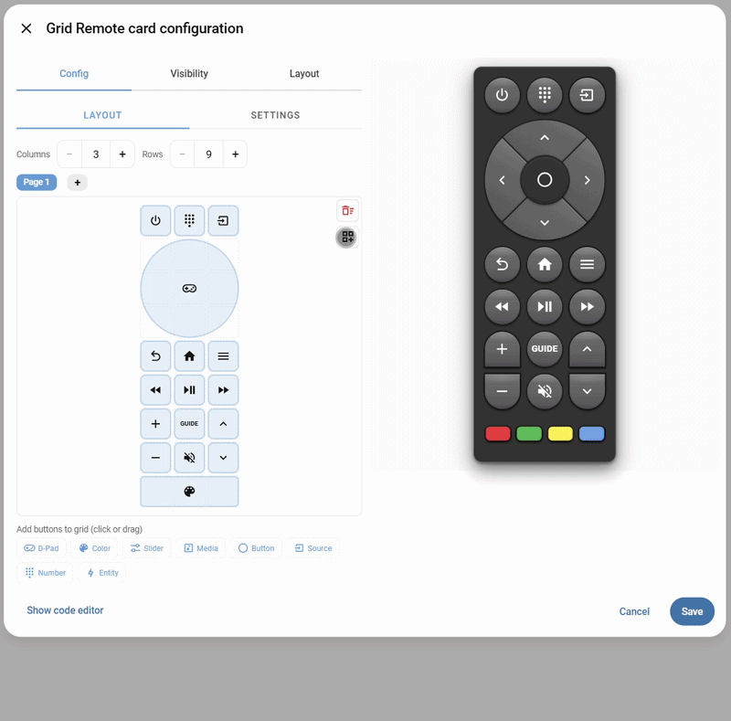

# Grid Remote Card

A fully customizable TV/media remote control card with drag-and-drop grid layout, multiple button types, source popup, and a visual editor.

[](https://github.com/hacs/integration)
[](https://github.com/thecodingdad/grid-remote-card/releases)

## Impression



## Features

- Multiple button types: D-Pad, Color Buttons, Slider, Media Info, Button, Source Button, Number Pad, Entity Button
- Configurable grid size and button size
- Buttons can be arranged with drag-and-drop in visual editor
- Multi-select editing: Ctrl/Cmd+click, marquee area selection, touch long-press; move or delete multiple items at once
- Copy-on-drag: hold Ctrl/Cmd while dragging (desktop) or tap the hint during drag (touch) to duplicate the selection instead of moving it — works across pages
- Page reordering by drag-and-drop on the page tabs
- Cross-page drag: drag items over a page tab to switch pages mid-drag; hover the `+` tab to create and switch to a new page
- Multiple button and slider designs: round, rounded, square, pill, pill (4 directions)
- Tap and hold action with repeat support (configurable intervals)
- Multi-page layout with swipe navigation and automatic page switch (configurable conditions per page)
- Haptic feedback (configurable), only triggered when an action actually fires
- Fully configurable colors (global and per button)
- Entity buttons expose separate colors for the active state (icon + background)
- Fully configurable numpad keys: per-key icon, text, colors, tap/hold action, and show/hide toggle
- Two default presets and multiple device/entity specific preset with predefined actions
- Full UI configuration (no exclusive YAML features)
- EN/DE multilanguage support

## Prerequisites

- Home Assistant 2026.3.0 or newer
- HACS (recommended for installation)

## Installation

### HACS (Recommended)

[](https://my.home-assistant.io/redirect/hacs_repository/?owner=thecodingdad&repository=grid-remote-card&category=plugin)

Or add manually:
1. Open HACS in your Home Assistant instance
2. Click the three dots in the top right corner and select **Custom repositories**
3. Enter `https://github.com/thecodingdad/grid-remote-card` and select **Dashboard** as the category
4. Click **Add**, then search for "Grid Remote Card" and download it
5. Reload your browser / clear cache

### Manual Installation

1. Download the latest release from [GitHub Releases](https://github.com/thecodingdad/grid-remote-card/releases)
2. Copy the `dist/` contents to `config/www/community/grid-remote-card/`
3. Add the resource in **Settings** → **Dashboards** → **Resources**:
   - URL: `/local/community/grid-remote-card/grid-remote-card.js`
   - Type: JavaScript Module
4. Reload your browser

## Usage

```yaml
type: custom:grid-remote-card
columns: 3
items:
  - type: button
    icon: mdi:power
    tap_action:
      action: perform-action
      perform_action: remote.send_command
      data:
        command: power
  - type: dpad
    col_span: 3
  - type: slider
    entity: media_player.tv
```

## Editor tips

- **Multi-select**: Ctrl/Cmd+click individual items, drag a marquee rectangle across the grid, or long-press on touch to build a selection. Press Esc or click the background to clear.
- **Multi-move**: dragging a selected item moves the whole selection together; the drop is only accepted when every item fits (no swap in multi-mode).
- **Copy instead of move**: while dragging, press Ctrl/Cmd (desktop) or tap the hint chip under the grid (touch) to toggle copy mode. The ghost shows a green `+` badge, and the dropped copy ends up selected.
- **Cross-page drag**: hover the drag over a page tab for ~400ms to switch to that page mid-drag, or hover the `+` tab to create a new page — the editor switches to the freshly created page immediately so you can drop straight onto it.
- **Reorder pages**: grab a page tab and drag it left/right; the tab bar live-reorders during the drag.
- **Delete items**: drag them onto the red trash icon at the top-right of the grid.
- **Clear / delete page**: tap the trash icon without dragging. On single-page cards this clears all items; on multi-page cards it deletes the current page.

## Configuration

### Card Options

| Option | Type | Default | Description |
|--------|------|---------|-------------|
| `items` | array | preset | Grid items configuration |
| `columns` | number | 3 | Number of grid columns (1-12) |
| `rows` | number | 9 | Number of grid rows (1-20) |
| `scale` | number | 100 | Card scale in percent (50-200) |
| `sizing` | string | `normal` | Sizing mode: `normal` (fit content) or `stretch` (fill container) |
| `page_count` | number | 1 | Number of pages for multi-page layouts |
| `page_conditions` | array | — | Conditions for automatic page switching |
| `ui_style` | string | `3d` | Card UI style: `3d` (plastic-button look) or `flat` |
| `card_background_color` | string | `#333` | Card background color (CSS or HA variable) |
| `icon_color` | string | `#fff` | Global default icon color |
| `text_color` | string | `#fff` | Global default text color |
| `button_background_color` | string | `#606060` | Global default button background color |
| `remote_border_color` | string | `#777` | Frame border color of the card and popups |
| `haptic_tap` | boolean | false | Haptic feedback on tap |
| `haptic_hold` | boolean | false | Haptic feedback on hold |
| `hold_repeat_interval` | number | 200 | Hold repeat interval in ms (50-1000) |

### Item Types

| Type | Size | Description |
|------|------|-------------|
| `button` | 1x1 | Generic action button with icon or text |
| `dpad` | 3x3 | Directional pad with up/down/left/right/center actions |
| `color_buttons` | 3x1 | Colored button row (red, green, yellow, blue) |
| `slider` | 3x1 | Volume/brightness/position slider control |
| `media` | 3x2 | Media player info with album art |
| `source` | 1x1 | Source selection popup button |
| `numbers` | 1x1 | Numeric keypad popup (0-9) |
| `entity` | 1x1 | Entity state toggle button with automatic active-state colors |

### Common Item Options

All item types support:

| Option | Type | Default | Description |
|--------|------|---------|-------------|
| `type` | string | required | Item type (see above) |
| `row` | number | required | Grid row position (0-based) |
| `col` | number | required | Grid column position (0-based) |
| `page` | number | 0 | Page number for multi-page layouts |

### Button Options

| Option | Type | Default | Description |
|--------|------|---------|-------------|
| `variant` | string | `round` | Button shape: `round`, `rounded`, `square`, `pill`, `pill_top`, `pill_bottom`, `pill_left`, `pill_right` |
| `icon` | string | `mdi:radiobox-blank` | MDI icon |
| `text` | string | — | Text label (replaces icon) |
| `icon_color` | string | — | Icon color (CSS) |
| `text_color` | string | — | Text color (CSS) |
| `background_color` | string | — | Background color (CSS) |
| `tap_action` | object | — | Action on tap (supports Jinja2 templates in `data` / `target`) |
| `hold_action` | object | — | Action on hold (supports Jinja2 templates in `data` / `target`) |
| `hold_repeat` | boolean | false | Repeat tap_action while held |
| `hold_repeat_interval` | number | — | Override global repeat interval (ms) |

### D-Pad Options

| Option | Type | Default | Description |
|--------|------|---------|-------------|
| `col_span` | number | 3 | Width in columns (always square) |
| `buttons` | object | — | Per-direction config (keys: `up`, `down`, `left`, `right`, `ok`) |

Each direction in `buttons` supports: `icon`, `text`, `icon_color`, `text_color`, `background_color`, `tap_action`, `hold_action`, `hold_repeat`, `hold_repeat_interval`.

### Slider Options

| Option | Type | Default | Description |
|--------|------|---------|-------------|
| `entity_id` | string | required | Entity to control |
| `variant` | string | `pill` | Slider shape: `round`, `rounded`, `square`, `pill`, `pill_top`, `pill_bottom`, `pill_left`, `pill_right`, `classic` (native range input) |
| `orientation` | string | `horizontal` | `horizontal` or `vertical` |
| `col_span` | number | 3 | Width for horizontal slider |
| `row_span` | number | 3 | Height for vertical slider |
| `attribute` | string | auto | Attribute to control (auto-detected from domain) |
| `min` | number | auto | Minimum value |
| `max` | number | auto | Maximum value |
| `step` | number | auto | Step size |
| `icon` | string | auto | Slider icon (auto-detected from entity, falls back to domain default) |
| `icon_color` | string | — | Icon color |
| `background_color` | string | — | Slider track background color |
| `fill_color` | string | — | Slider fill color |
| `show_icon` | boolean | true | Show icon next to slider |
| `slider_live` | boolean | false | Send value while dragging |

Auto-detection by domain: light (brightness 0-255), media_player (volume 0-1), cover (position 0-100), fan (percentage 0-100), input_number/number (from entity attributes).

### Entity Button Options

Supports all [Button Options](#button-options), plus:

| Option | Type | Default | Description |
|--------|------|---------|-------------|
| `entity_id` | string | required | Entity to control |
| `active_background_color` | string | — | Background color used when the entity is active (auto-applied; leave empty for the normal background) |
| `active_icon_color` | string | — | Icon color used when the entity is active (leave empty for the normal icon color) |

### Number Pad Options

| Option | Type | Default | Description |
|--------|------|---------|-------------|
| `buttons` | object | — | Per-key config (keys: `0`..`9`, `dash`, `enter`) |

Each key in `buttons` supports: `icon`, `text`, `icon_color`, `text_color`, `background_color`, `tap_action`, `hold_action`, `hold_repeat`, `hold_repeat_interval`, plus `hidden: true` to remove the key from the keypad (the layout keeps its slot so remaining keys don't shift).

### Source Button Options

| Option | Type | Default | Description |
|--------|------|---------|-------------|
| `source_entity` | string | — | `select` / `media_player` entity — sources are loaded automatically from the entity, manual overrides are merged on top |
| `sources` | array | — | Manual source entries (each with `name`, `label`, `icon`, `image`, `tap_action`, `hidden`) |

### Media Tile Options

| Option | Type | Default | Description |
|--------|------|---------|-------------|
| `entity_id` | string | required | `media_player`, `image`, or `camera` entity |
| `show_info` | boolean | true | Show title/artist at the bottom |
| `scroll_info` | boolean | false | Scroll long text instead of truncating |
| `fallback_icon` | string | `mdi:music` | Icon shown when no cover art is available |

## Multilanguage Support

This card supports English and German.

## Development

The card is written in TypeScript and bundled with esbuild.

Requires Node 20+.

```bash
npm install       # Once, sets up tooling
npm run dev       # Watch mode (~50ms rebuilds)
npm run build     # Production build → dist/grid-remote-card.js
npm run typecheck # TypeScript check without emit
```

Source lives in `src/`, output is committed to `dist/` for HACS consumers.
Edit files under `src/` and run `npm run build`.

## License

This project is licensed under the MIT License - see the [LICENSE](LICENSE) file for details.
